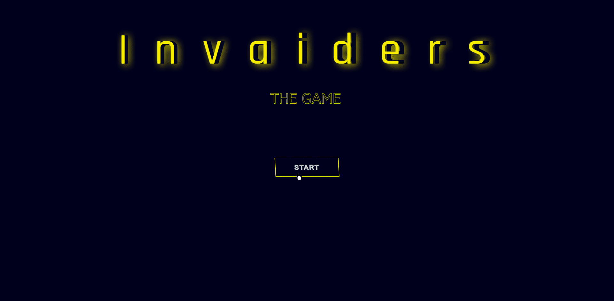

<h1 align="center">
    
</h1>

<h4 align="center">
    Projeto desenvolvido no Bootcamp Órbi Web Games Developer em parceiria com a DIO. O projeto consiste em praticarmos a manipulação
    da DOM e a lógica com JavaScript. 
</h4>
 

    

 

### 🚀 Tecnologias

 Projeto desenvolvido com as seguintes tecnologias: 

- JavaScript
- Css 3
- Html 5

 

### Vercel
Aqui você pode visualizar o projeto, é só clicar em:
[Wakizash](https://spaceShooter.vercel.app/)

 

### 🚧 Features:
✔️ Implementar a tela de start  
✔️ Implementar a tela e a lógica para a escolha da nave  
✔️ Implementar o score e a quantidade de pontos conforme qual nave invasora acertar  
✔️ Implementar os sons de todo o Game  
✔️ Implementar a tela de Game Over  
✔️ Correção de Bugs envolvendo a parte de explosões das naves  

 

 

Feito com 💖 por TamirysNogueira. [Get in Touch!](https://www.linkedin.com/in/tamirys-nogueira-346958205/)